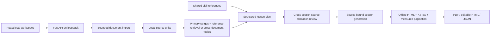

# Architecture

## Boundaries

`models.py` defines data passed between importers, providers, generation and rendering. The provider accepts typed JSON schemas and validates responses before they enter the renderer. HTML is generated by local templates; model content is Markdown with raw HTML disabled. KaTeX and fonts are embedded for offline delivery.

Document import has file-size, expanded ZIP, image, text and unit limits. Legacy Office conversion invokes an optional LibreOffice executable with a separate profile and timeout. It is a converter, not a general hostile-document sandbox.

The server serves a single local workspace, restricts host and origin, and does not expose arbitrary filesystem paths. IDs and artifact filenames are allowlisted. Uploads and extraction run locally; model requests begin only when generation is submitted. Topic mode analyzes candidate units in bounded batches without truncating each chapter to its opening paragraph.

## Generation

1. Preserve original source units. For scan-like pages, or every image unit in explicit handwriting mode, request multimodal transcription with LaTeX and uncertainty markers. Save a separate transcription record; never overwrite the original image/text. Keep explicit ranges as primary units and extract a bounded search focus; inspect other documents in full-unit batches for related references. Topic mode searches each selected file directly. Record examined and selected refs with reasons.
2. Let the model choose a nonempty chapter plan from the content, dependencies and coherent learning goals, with a substantive overview and source references. There is no operator-selected count, default chapter quota or 2–8 chapter range. Validate selected-unit coverage, unique IDs and reference existence, allowing repairs to change the number of chapters. Unless every section already has all selected units, run one focused source-allocation review over the plan and selected material. It may append only selected references to existing sections, keeping their targets and original references. This lets an introduction use a later formal statement without passing every source to every writer. Save original references, additions with reasons, and revised references in `section-source-review.json`; reject unknown or repeated section IDs and references outside the selection. Writing, progress and rendering follow the resulting plan length; concurrency and input limits remain independent of chapter count.
3. Select relevant chapters from the shared learning-method library.
4. Generate sections with bounded concurrency and pass the topic constraint to every stage. Writers receive their revised source allocation, including text and available images. Explain the selected concepts and conclusions beyond slide wording, using sufficient conditions, reasoning and examples; attribute supplements accurately and choose proof depth according to the learning target. A second source-backed model pass reviews each draft's conditions, attribution, repetition and answer-bearing prompts; this is a correction step, not a proof of semantic accuracy.
5. Validate IDs, references, per-file source explanations and answer-bearing prompt requirements. Primary pages remain in scope; reference material cannot replace them or silently expand the curriculum.
6. Render, verify content retention, math, dimensions and internal destinations; publish downloads only after completion.

Source citations carry primary/reference/topic roles. PDF includes readable source locations and explanations. The same-origin web reader enables source buttons in the HTML artifact; it previews existing source units and retains the lesson iframe and scroll position while the source view is open. Standalone HTML and PDF do not depend on those source buttons.

Requests have bounded HTTP retries for transient service failures. Invalid JSON gets one structured regeneration attempt. Planning reference repair is bounded. Cancelling a job cancels section tasks; the provider client closes without leaving orphaned sibling requests. A cancellation cannot retract tokens already processed remotely.

## State and credentials

Document and job metadata use atomic JSON replacement under the application data directory. There are at most two active generation workers and a bounded queue. Restart marks unfinished jobs interrupted. The current implementation is a local process queue, not a distributed resumable worker system.

Keys from the UI exist only for the active request; persisted request metadata excludes `api_key`. Environment credentials are used only for their matching configured endpoint. Error responses do not reflect provider bodies or validation inputs, which might contain a key.

## Packaging

`frontend/dist` and `skills/learnmargin` are included in the Python wheel. Installed users need Python and Playwright Chromium, not a Node runtime. Developers build the frontend before packaging. The independent skill ZIP contains only its own instructions/resources, with no original EPUB, private documents or generated local test artifacts.
